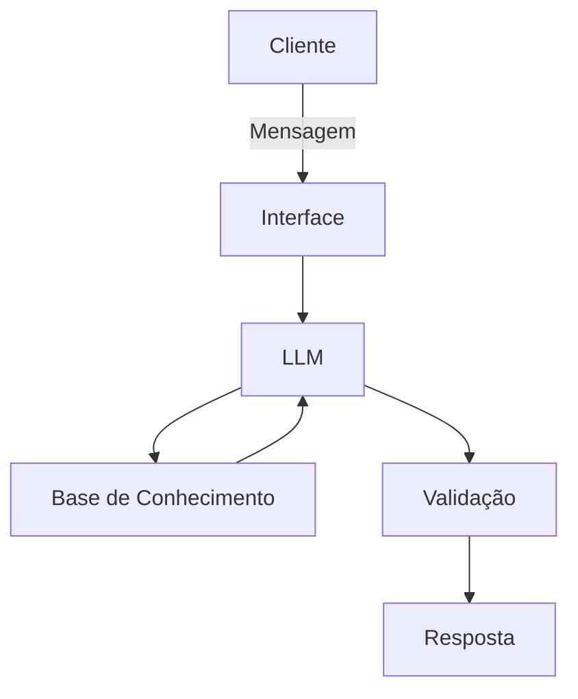

# Documentação do Agente

## Caso de Uso

### Problema
> Qual problema financeiro seu agente resolve?

Muitas pessoas têm dificuldade em controlar seus gastos mensais e não conseguem atingir metas financeiras (como poupar dinheiro, quitar dívidas ou fazer uma viagem). Isso acontece por falta de organização e de acompanhamento dos gastos no dia a dia.

### Solução
> Como o agente resolve esse problema de forma proativa?

O agente funciona como um assistente que ajuda o usuário a cuidar do dinheiro de forma simples:

* Registra gastos
* Mostra para onde o dinheiro está indo
* Acompanha metas (ex: guardar R$ 5.000)
* Sugere formas simples de economizar

### Público-Alvo
> Quem vai usar esse agente?

* Pessoas de todas a ideades que queiram organizar melhor o dinheiro
* Quem tem dificuldade para economizar
* Quem tem metas financeiras (viagem, compra, reserva)

---

## Persona e Tom de Voz

### Nome do Agente
Nina

### Personalidade
> Como o agente se comporta? (ex: consultivo, direto, educativo)

Amigável, educado, empático e direto.

### Tom de Comunicação
> Formal, informal, técnico, acessível?

Informal e acessível

### Exemplos de Linguagem
- Saudação: [ex: "Olá! Como posso ajudar com suas finanças hoje?"]
- Confirmação: [ex: "Entendi! Deixa eu verificar isso para você."]
- Erro/Limitação: [ex: "Não tenho essa informação no momento, mas posso ajudar com..."]

---

## Arquitetura

### Diagrama

### Componentes

| Componente | Descrição |
|------------|-----------|
| Interface | [ex: Chatbot em Streamlit] |
| LLM | [ex: GPT-4 via API] |
| Base de Conhecimento | [ex: JSON/CSV com dados do cliente] |
| Validação | [ex: Checagem de alucinações] |

---

## Segurança e Anti-Alucinação

### Estratégias Adotadas

- [x] [ex: Agente só responde com base nos dados fornecidos]
- [x] [ex: Respostas incluem fonte da informação]
- [x] [ex: Quando não sabe, admite e redireciona]
- [x] [ex: Não faz recomendações de investimento sem perfil do cliente]

### Limitações Declaradas
> O que o agente NÃO faz?

* Substitui um especialista em finanças
* Garante que o usuário vai economizar
* Faz previsões exatas do futuro
* Dá recomendações avançadas de investimento
